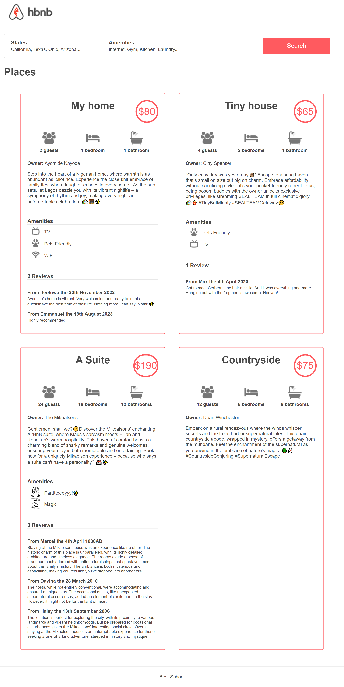
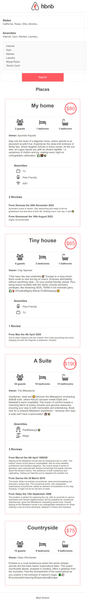

# Project: 0x01. AirBnB clone - Web static

## Resources

#### Read or watch

* [Learn to Code HTML & CSS](https://learn.shayhowe.com/html-css/)
* [Inline Styles in HTML](https://www.codecademy.com/article/html-inline-styles)
* [Specifics on CSS Specificity](https://css-tricks.com/specifics-on-css-specificity/)
* [Introduction to HTML](https://developer.mozilla.org/en-US/docs/Learn/HTML/Introduction_to_HTML)
* [CSS](https://developer.mozilla.org/en-US/docs/Learn/CSS)
* [MDN](https://developer.mozilla.org/en-US/)
* [center boxes](https://css-tricks.com/centering-css-complete-guide/)

## Learning Objectives

### General

* What is HTML
* How to create an HTML page
* What is a markup language
* What is the DOM
* What is an element / tag
* What is an attribute
* How does the browser load a webpage
* What is CSS
* How to add style to an element
* What is a class
* What is a selector
* How to compute CSS Specificity Value
* What are Box properties in CSS

## Tasks

| Task | File |
| ---- | ---- |
| 0. Inline styling | [0-index.html](./0-index.html) |
| 1. Head styling | [1-index.html](./1-index.html) |
| 2. CSS files | [2-index.html](./2-index.html), [styles/2-common.css](./styles/2-common.css), [styles/2-header.css](./styles/2-header.css), [styles/2-footer.css](./styles/2-footer.css) |
| 3. Zoning done! | [3-index.html](./3-index.html), [styles/3-common.css](./styles/3-common.css), [styles/3-header.css](./styles/3-header.css), [styles/3-footer.css](./styles/3-footer.css), [images/](./images/) |
| 4. Search! | [4-index.html](./4-index.html), [styles/4-common.css](./styles/4-common.css), [styles/3-header.css](./styles/3-header.css), [styles/3-footer.css](./styles/3-footer.css), [styles/4-filters.css](./styles/4-filters.css), [images/](./images/) |
| 5. More filters | [5-index.html](./5-index.html), [styles/4-common.css](./styles/4-common.css), [styles/3-header.css](./styles/3-header.css), [styles/3-footer.css](./styles/3-footer.css), [styles/5-filters.css](./styles/5-filters.css), [images/](./images/) |
| 6. It's (h)over | [6-index.html](./6-index.html), [styles/4-common.css](./styles/4-common.css), [styles/3-header.css](./styles/3-header.css), [styles/3-footer.css](./styles/3-footer.css), [styles/6-filters.css](./styles/6-filters.css), [images/](./images/) |
| 7. Display results | [7-index.html](./7-index.html), [styles/4-common.css](./styles/4-common.css), [styles/3-header.css](./styles/3-header.css), [styles/3-footer.css](./styles/3-footer.css), [styles/6-filters.css](./styles/6-filters.css), [styles/7-places.css](./styles/7-places.css), [images/](./images/) |
| 8. More details | [8-index.html](./8-index.html), [styles/4-common.css](./styles/4-common.css), [styles/3-header.css](./styles/3-header.css), [styles/3-footer.css](./styles/3-footer.css), [styles/6-filters.css](./styles/6-filters.css), [styles/8-places.css](./styles/8-places.css), [images/](./images/) |

### Reveal🤭✨
Attached below are screenshots of how my design looks after I finished the project. I'm good at this sh!t (language🤭😅)

- Desktop

- Mobile

